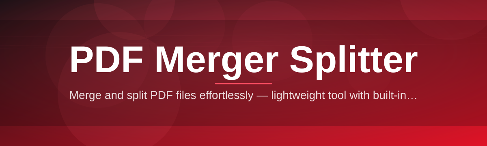
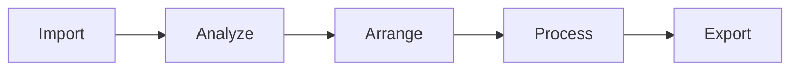

# pdf-merger-splitter-tool 📄🧩

  

*One reliable workstation for combining, dividing, and restructuring PDF documents — built for people who cannot afford surprises.*

  

---

## 🏛️ Overview

Every organization eventually inherits a filing cabinet made of PDFs — scanned contracts, exported reports, signed appendices, and paginated statements that all need to be reshaped before they're useful. **pdf-merger-splitter-tool** was built to be the dependable hand that does that reshaping: merging scattered documents into a single authoritative file, or slicing a bloated file into the exact pages a colleague actually needs. It started as an internal utility for a document-heavy back office that had grown tired of routing simple page-management tasks through browser uploaders of uncertain provenance, and it has since matured into a standalone Windows application that treats every PDF operation as a small act of record-keeping.

The design philosophy is straightforward: a PDF merger and splitter should behave like plumbing, not like a puzzle. That means predictable page ordering, lossless output, and zero surprises when a 400-page compliance archive needs to be split into individually numbered chapters at two in the morning. We optimized for the people who touch PDFs constantly but don't want to think about PDF internals — paralegals assembling exhibit binders, finance teams consolidating monthly statements, students merging lecture slides, and IT admins scripting recurring document workflows.

This is not a document editor, a signature platform, or a cloud-sync suite — and it doesn't pretend to be. It is a focused instrument for PDF merging, PDF splitting, page extraction, and reordering, engineered to run entirely on your machine, with your files never leaving your control unless you choose to move them yourself.

> [!NOTE]
> The download button above routes to the official project landing page, where the current build is published along with release notes and checksums.

---

<strong>🧰 What's Inside — Capabilities Worth Knowing About</strong>

&nbsp;

- **Multi-file merging with drag-ordered sequencing** — drop in as many PDFs as you need, then reorder them visually before committing to a single merged output, so the final document reads exactly as intended.

- **Precision splitting by page range, interval, or bookmark** — carve a document into fixed-size chunks, arbitrary page ranges, or split at every bookmark boundary for chapter-accurate output.

- **Selective page extraction** — pull individual pages or non-contiguous ranges out of a larger file without disturbing the source document.

- **Batch processing queue** — line up multiple merge or split jobs and let the tool work through them sequentially, ideal for recurring reporting cycles.

- **Lossless page fidelity** — text, vector graphics, embedded fonts, and image resolution are preserved exactly; nothing is rasterized or recompressed unless you explicitly request it.

- **Offline-first operation** — every merge and split happens locally on your device; there is no upload step and no server dependency in the core workflow.

- **Rotation and orientation correction** — fix sideways scans or mixed-orientation pages before merging, so the final PDF reads consistently from cover to cover.

- **Metadata-aware output** — title, author, and creation-date fields carry through predictably, which matters when merged files feed into archival or compliance systems.

&nbsp;

<strong>🚀 Getting Set Up — From Zero to First Merge</strong>

&nbsp;

1. **Visit the landing page** using the download button on this page — that's the only distribution channel we maintain.

2. **Download the latest build** for Windows; the package is a single standalone executable with no bundled installer wizard to click through.

3. **Run the application** directly — no separate runtime, framework, or dependency installation is required beforehand.

4. **Load your PDFs**, choose Merge or Split from the main screen, arrange your pages or files, and export.

&nbsp;

> [!TIP]
> Pin the executable to your taskbar if you handle PDFs daily — most sessions from launch to exported file take under a minute.

&nbsp;

---

## 💻 System Requirements

| Component | Minimum | Recommended |
|---|---|---|
| Operating System | Windows 10 (64-bit) | Windows 11 (64-bit) |
| Memory | 4 GB RAM | 8 GB RAM |
| Storage | 150 MB free | 500 MB free for large batch jobs |
| Dependencies | None | None |
| Internet | Not required for core use | Required only to download updates |

  

> [!IMPORTANT]
> This tool ships as a standalone executable. It does not require a separate runtime, and it does not silently install background services.

---

## ⚙️ How It Works

Under the hood, the merger and splitter share a common document engine, so the same reliability guarantees apply whether you're combining ten files or dividing one:

1. **Ingestion** — selected PDFs are parsed and validated for structural integrity before anything else happens.

2. **Page mapping** — the tool builds an internal page map reflecting your chosen order, ranges, or split points.

3. **Transformation** — pages are merged, extracted, or reflowed into new documents according to that map, with fonts and images carried through untouched.

4. **Export** — final files are written to your chosen destination with predictable, human-readable naming.

> [!NOTE]
> No intermediate copies of your documents are transmitted anywhere during this pipeline — processing is entirely local to the pipeline stages above.

---

<strong>🩺 Troubleshooting — Answers to Recurring Questions</strong>

&nbsp;

**Q: My merged PDF is larger than the sum of its source files. Is that normal?**
A: Occasionally, yes — if source files used different compression settings, the merge engine may standardize encoding, which can slightly increase size while preserving quality.

**Q: The split output skipped a page range I specified.**
A: Double-check for zero-indexed versus one-indexed range entry; the tool uses one-indexed page numbers matching what you see in a PDF viewer.

**Q: A password-protected PDF won't load for merging.**
A: Encrypted PDFs must be unlocked with their existing password before ingestion — this tool respects existing document security and will not attempt to bypass it.

**Q: Bookmarks disappeared after splitting into chapters.**
A: Enable "Preserve Outline" in split settings; without it, each split segment is treated as a fresh document with no inherited bookmark tree.

**Q: The application won't launch after a Windows update.**
A: Re-download the latest build from the landing page — occasional Windows security policy changes require a refreshed binary signature.

**Q: Can I merge scanned image-based PDFs with text-based PDFs?**
A: Yes — the merge engine treats each page as a self-contained unit regardless of whether its content is scanned imagery or native text.

&nbsp;

---

## 🎛️ Interface, Shortcuts & Personalization

The interface favors clarity over decoration — large drop zones, a visible page-order strip, and a single export button that stays put regardless of which mode you're in.

| Action | Shortcut |
|---|---|
| Open files | `Ctrl + O` |
| Merge selected | `Ctrl + M` |
| Split at cursor | `Ctrl + S` |
| Undo page move | `Ctrl + Z` |
| Export | `Ctrl + E` |
| Toggle dark theme | `Ctrl + D` |

- **Light and dark themes**, both tuned for extended page-review sessions.
- **Thumbnail preview strip** so you can confirm order before committing to export.
- **Configurable default export folder**, so batch jobs don't scatter files across your drive.

> [!TIP]
> Dark theme is easier on the eyes during long document-assembly sessions — toggle it from Settings or the shortcut above.

---

## 🤝 Contributing & Community

Contributions, issue reports, and feature discussions are welcome from anyone who works with PDFs regularly and has opinions about how merging and splitting should behave. Open an issue to propose a change, describe a bug with reproduction steps, or share a workflow the tool doesn't yet support gracefully.

> [!WARNING]
> Before filing a bug, confirm you're on the latest build from the official landing page — older builds may already have your issue resolved.

---

## 📜 License

Released under the [MIT License](LICENSE), 2026. Use it, adapt it, build on it — attribution appreciated, obligations minimal.

---

## ⚖️ Disclaimer

This software is provided "as is," without warranty of any kind, express or implied. While the project is built with reliability as a first principle, users are responsible for maintaining independent backups of any documents processed through merging or splitting operations. The maintainers are not liable for data loss, workflow interruption, or downstream consequences arising from use of this tool.

